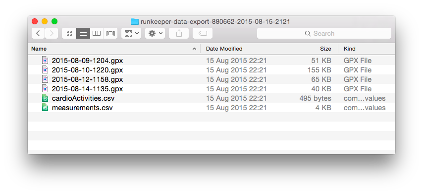
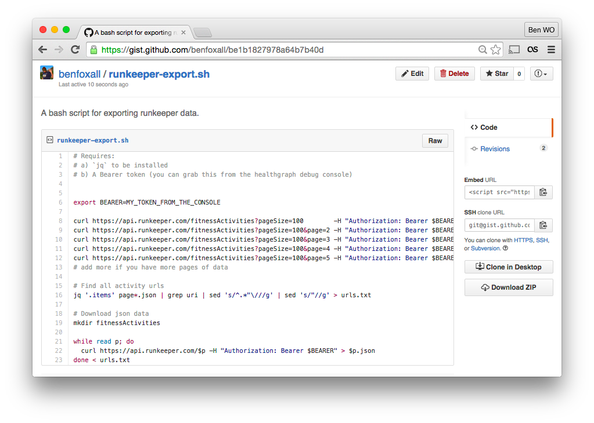
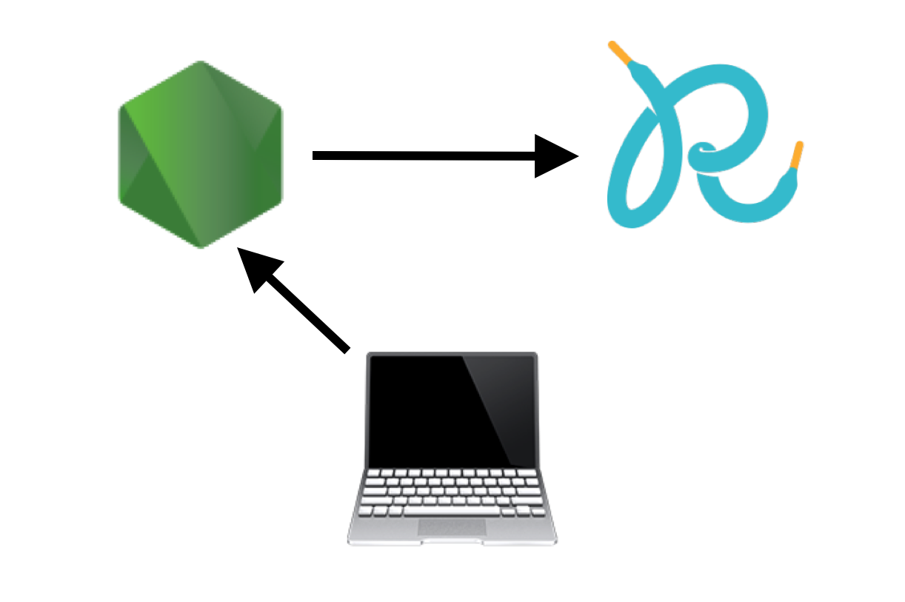
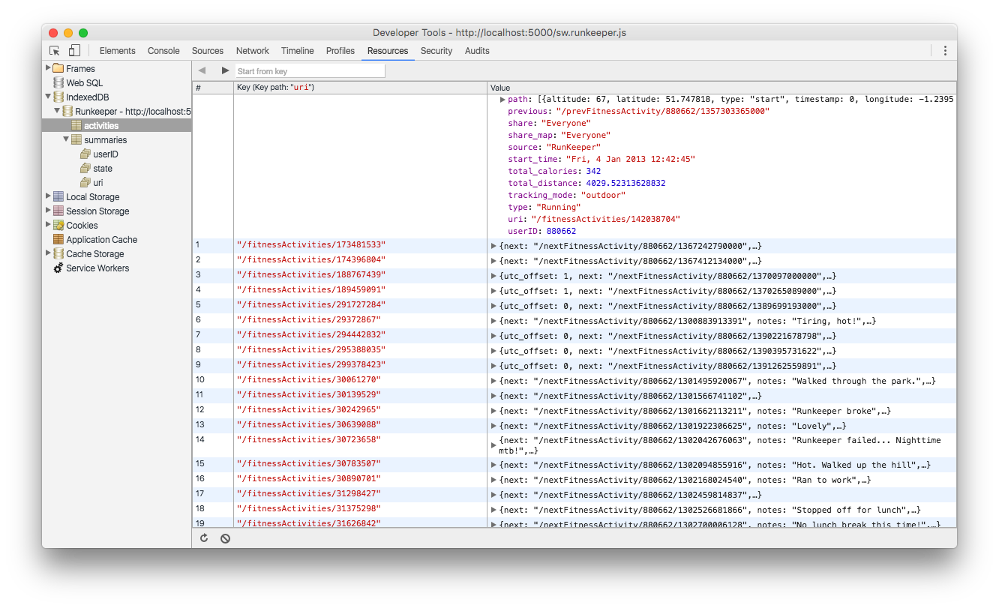

build-lists: true

# Serving Data from browsers

---

# I’m Ben

#### (@benjaminbenben)

---


---


---


# [fit] the internet button

---


—


^ I’m bad at keeping secrets, this is the secret that I’m currently being bad at keeping

—

# Serving Data from browsers

—

## spoiler alert:
## Service workers

^ Though there’s a LOT that is not specific to service worker

—

## :+1: Thanks, Phil


^ Phil is covering service workers, so I’m going to talk more about a particular use case for them

^ Nothing as useful as what Phil showed

—

### What we’re talking about:

# My data :arrow_right: :cloud:

### As a User, I want to have my data in a CSV document

—

## LastFM
## Runkeeper

^ Everyone knows what lastfm is

—

### benfoxall/last-fm-to-csv
### benfoxall/runkeeper-to-csv

^ I’ve got quite a lot of experience with both of these
We’re going to switch back and forth with the examples

—

# How do we get our data?

#### (runkeeper)

^ We’re going to use Runkeeper as examples here

—

# Attempt 1

—

# Download it


—


—



—

# 👌

* Job Done
* Works Offline

^
* We’ve got our data
* We’ve downloaded it

—

# 💥

* No format control
* Functionality might change/disappear


^
* gpx + csv, perhaps we wanted lat/lng
* lastfm removed their downloading options in the newest rebrand

—

# Attempt 2

—

# Write a script

—


```bash
export BEARER=MY_TOKEN_FROM_THE_CONSOLE

curl https://api.runkeeper.com/fitnessActivities?pageSize=100        -H "Authorization: Bearer $BEARER" > page1.json
curl https://api.runkeeper.com/fitnessActivities?pageSize=100&page=2 -H "Authorization: Bearer $BEARER" > page2.json
curl https://api.runkeeper.com/fitnessActivities?pageSize=100&page=3 -H "Authorization: Bearer $BEARER" > page3.json
curl https://api.runkeeper.com/fitnessActivities?pageSize=100&page=4 -H "Authorization: Bearer $BEARER" > page4.json
curl https://api.runkeeper.com/fitnessActivities?pageSize=100&page=5 -H "Authorization: Bearer $BEARER" > page5.json

jq '.items' page*.json | grep uri | sed 's/^.*"\///g' | sed 's/"//g' > urls.txt

mkdir fitnessActivities

while read p; do
  curl https://api.runkeeper.com/$p -H "Authorization: Bearer $BEARER" > $p.json
done < urls.txt
```

—



—

# 👌

* format choices
* sharable
* offline

^
* you have the raw data, you can choose what it says
* Offline -> we’ve got the source data, so we can take different

—

# 💥

* Inaccessible


—

# Attempt 3

—

# Make a Web Service

—


—


—

# 👌

* Accessible to more people
* Works offline*

^
* once it’s been downloaded, you can plug it into excel

—

# 💥

* Non-trivial backend
* Handling sensitive data
* Waiting for processing

—

# Attempt 4

—

# Go Client-Side

—



—


—


—

# 👌

* Data stored locally
* Available instantly

—

#### <sub>💥</sub>

#### <sub>__it might not totally work all the time__</sub>

—

# Cool

—

# TODO (in browser):

1. Request from data source
2. Process data (:arrow_right: csv)
3. Serve to user

—

# [fit] 1. Request > 2. Process > 3. Serve
#### (lastfm)

—

# 1. Request

—

## a one function JavaScript API

```js
const lastFM = params =>
    fetch("http://ws.audioscrobbler.com/2.0/?"+
          "method=user.getrecenttracks&format=json"+
          "&api_key=974a5ebc077564f72bd639d122479d4b&"+
          params)
        .then(r => r.json())
```


^ I really like how promises and arrow functions make it nice to compose promises.

—

## What requests do we need for a user?

```js
const requestsForUser = username =>
    lastFM(`user=${username}`)
        .then(_find_number_of_pages_)
        .then(number =>
            Array.from({length: number - 1}, (_,i) =>
                `user=${username}&page=${i+1}`
            )
        )
```


^
* `_find_number_of_pages_` is `recenttracks.@attr.totalPages/200`.
* Props to Jack for the Array.from stuff

—

## What requests do we need for a user?

```js
requestsForUser("benjaminf")

// resolves to:

[
 "user=benjaminf&page=1",
 "user=benjaminf&page=2",
 "user=benjaminf&page=3",
 "user=benjaminf&page=4",
 …
]
```

—

# Make requests

```js
const dataForUser = username =>
    requestsForUser(username)
        .then(requests =>
            Promise.all(
                requests.map(lastFM)
            )
        )
```


^
You do have to deal with throttling, but I’m not going into that just now

—

# 2. Process

—

## json :arrow_right: csv

—

## The way you should probably do this…

[papaparse.com/docs#json-to-csv](http://papaparse.com/docs#json-to-csv)

—

## …Another way

```js
// pull out a row of keys
const row = (keys, obj) =>
  keys.map(k => obj[k])

// create a csv row from an array
const csv = array =>
  array.map(item =>
    typeof(item) === 'string'
        ? item.replace(/[\",]/g,'')
        : item
  ).join(',') + "\n"

/*
csv(row(["a","b","n"],{b: "\"bar\"", c: "yeah", a: "foo", n: 42})
 > "foo,bar,42"
*/
```


^ I do the ternary like that just to tell people “whatever”

—

```js
const process = response =>
    response.tracks.map(track =>
        csv(track, ["artist", "name"])
    )
```

—

```js
Promise.all(
    requests.map( r => lastFM(r).then(process) )
)
.then(parts => parts.join(""))
```

—


# 3. Serve

^ We’ve got a string of csv, now what?

—

### Data URIs

—

`data:[<mediatype>][;base64],<data>`

—

`data:text/html,<h1>Hello World`

—

`data:text/csv,a,b,c%0A1,2,3`

^ you can also base64 encode

—

### All Together

```js
const process = response =>
    response.tracks.map(track =>
        csv(track, ["artist", "name"])
    )

const dataForUser = username =>
    requestsForUser(username)
        .then(requests =>
          Promise.all(
            requests.map(lastFM)
          )
          .then(parts => parts.join(""))
        )
```

—

### All Together

```js
dataForUser("benjaminf")
    .then( csv => {
        const link = document.createElement("a")
        link.href = _to_data_uri(csv, "text/csv")
        link.innerText = "Download csv"
        document.body.appendChild(link)
    })
```

—


# URGH

```js
.then(csv => {

_to_data_uri(csv, "text/csv")
```

—

# [fit] Blobs

—

# [fit] `new Blob(parts [,options])`
—

```js
const blob = new Blob(["a,b,c\n", "d,e,f"],{type : "text/csv"})
const url = window.URL.createObjectURL(blob)
// > "blob:…/41f8da4d-…-dbdc62106843"

const a = document.createElement("a")
a.textContent = a.href = url
document.body.appendChild(a)
```

^ Outside of the js heap
^ one of those options is mime type

—

```js
const process = response =>
    response.tracks.map(track =>
        csv(track, ["artist", "name"])
    )

const dataForUser = username =>
    requestsForUser(username)
        .then(requests =>
          Promise.all(
            requests.map( req => lastFM(req).then(process) )
          )
          .then(parts => parts.join(""))
        )

```

—

```js
const process = response =>
    new Blob(response.tracks.map(track =>
        csv(track, ["artist", "name"])
    ))

const dataForUser = username =>
    requestsForUser(username)
        .then(requests =>
          Promise.all(
            requests.map( req => lastFM(req).then(process) )
          )
          .then(parts => new Blob(parts, {type : "text/csv"}))
        )

```

—


```js
dataForUser("benjaminf")
    .then( csv => {
        const link = document.createElement("a")
        link.href = _to_data_uri(csv, "text/csv")
        link.innerText = "Download csv"
        document.body.appendChild(link)
    })
```


—

```js
dataForUser("benjaminf")
    .then( csv => {
        const link = document.createElement("a")
        link.href = URL.createObjectURL(csv)
        link.innerText = "Download csv"
        document.body.appendChild(link)
    })
```

—

# [fit] 1. Request > 2. Process > 3. Serve

^ And we’re done
^ Requesting via fetch, processing into Blob & saving with ObjectURL

—

[benjaminbenben.com/lastfm-to-csv/](http://benjaminbenben.com/lastfm-to-csv/)


^ **MISSING**
* rate limiting
* streaming & partial downloads

—

# Cool, but…

## 1. Data loss on exit
## 2. No URLs
## 3. DOESN’T WORK OFFLINE

—

# [fit] :tada: Service Workers :tada:

### (& IndexedDB)

—

# [fit] 1. Request > 2 Save > 3. Process > 4. Cache > 5. Serve*

#### (runkeeper)


—-

## 1. Request

—

### Pretty much the same frontend

^ expand requests for a user

—


^ https for service worker

—

## 2. Save
### :new:

—

IndexedDB (via Dexie)


```js
var db = new Dexie("Runkeeper")
db.version(1).stores({
  activities: "&uri"
})
db.open();

// on request
fetch('data' + uri, { credentials: 'include' })
  .then(res =>  res.json() )
  .then(data => db.activities.put(data))
```

^ The run keeper api has a uri key
^ minimal index, but could support filtering by multiple users easily
^ could be in SW, or not (I like Worker)

—



—

## 3. Process

—

### Summary response
```js

function summaryResponse() {
  console.time('build summary')

  var keys = ['uri', 'duration', 'type', 'start_time', 'total_distance', 'climb', 'total_calories'];
  var rows = [keys];

  return db
    .activities
    .reverse()
    .each(function(activity){
      rows.push(
        row(keys, activity)
      )
    })
    .then(function(){
      console.timeEnd('build summary');

      var data = new Blob(rows.map(function(row){
        return csv(row) + '\n';
      }));

      return new Response( data, {
        headers: { 'Content-Type': 'text/csv' }
      });
    })

}
```

^
* we’re looking through the db rather than querying everything
* As well as the Blob, we’re creating a Response with Headers
* console.time - can be hard to tell where the pain is, for instance here, it’s not so important to build up blobs


—

## 4. Cache
### :new: :tada:

—


```js
function respond(event, generator){

  event.respondWith(
    caches.match(event.request)
    .then(cached => {
      if(cached)
        return cached
      else
        return respondAndCache()
    })
  )

  function respondAndCache(){
    return generator()
      .then((response) => {

        var responseToCache = response.clone();

        caches.open(CACHE_NAME)
          .then((cache) =>
            cache.put(event.request, responseToCache);
          )

        return response;
      })
  }
}
```

—

## 5. Serve
### :tada: :new: :tada:

—

## Serve sw/summary.csv

```js
self.addEventListener('fetch', event =>
    if(event.request.url.match(/sw\/summary\.csv$/))
      respond(event, summaryResponse)
)
```

—

### WIN: multiple views

```js

self.addEventListener('fetch', event =>  {

    if(event.request.url.match(/sw\/summary\.csv$/))
      respond(event, summaryResponse)

    if(event.request.url.match(/sw\/distances\.csv$/))
      respond(event, distancesResponse)

    if(event.request.url.match(/sw\/paths\.csv$/))
      respond(event, pathsResponse)

    if(event.request.url.match(/sw\/geo\.json$/))
      respond(event, geoJSONResponse)

    if(event.request.url.match(/sw\/geo\.simple\.json$/))
      respond(event, geoJSONResponseSimple)

    if(event.request.url.match(/sw\/binary\.path\.b$/))
      respond(event, binaryPathResponse)

})
```


^
Offline!!

—


# 👌

* Offline
* Super Fast
* Super great


^ super fast, indexeddb takes time to spin up

—

# [DEMO](http://localhost:5000)

—

## Github:

### benfoxall/last-fm-to-csv
### benfoxall/runkeeper-to-csv

—

## Online

### http://benjaminbenben.com/lastfm-to-csv/
### https://runkeeper-to-csv.herokuapp.com/

—

# $ $ PROFIT! $ $

—

# Thanks!

### @benjaminbenben
